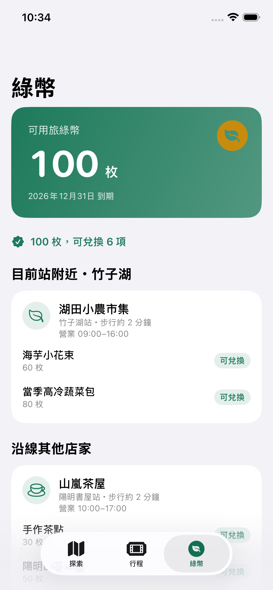

# 2026-09-29 現行 App 檢測證據

程式：`2bf6948`；App 原始碼未修改。iPhone 16e／iOS 26.5／390×844 pt。

- [新版修改方針](../../../Claude_Code_遊客端UX改版方針.md)：已完成、未完成、路線與減碳方案、Claude Code 提示。
- [測試記錄](xcodebuild-test.log)：34 個單元／整合＋4 個 UI 測試，0 失敗，TEST SUCCEEDED。
- [截圖索引](test-attachments/manifest.json)：11 張本次 UI 測試截圖，全部目視檢查。
- [原始官方 CSV](taiwantrip-official-93967.csv)、[品質報告](route-quality.json)、[重跑程式](check_routes.py)。
- [舊方針備份](改版方針_更新前備份.md)、[舊接手筆記備份](接手筆記_更新前備份.md)。

## 主要觀察

三分頁與任務至兌換的操作清楚；首頁同屏可比較兩班，完成後兩次點擊可產生 QR。主要缺口為示範標示、上車與回程資訊、取消入口、旅客減碳明細。舒適度不是實測、店家為虛構；目前站附近其實是任務終點。手動出發掃碼成功時，標題提前切到到站驗證，應修正文案狀態。

本次不是受試者易用性研究。其他尺寸、深色、大字級與 VoiceOver 未重跑；實機相機／定位與 TDX 授權資料仍未驗證。模擬掃描只驗證展示流程。

## 首頁


## 任務完成


## 綠幣中心



## 資料驗證重跑

```bash
python3 check_routes.py
```

此程式只讀原始 CSV，另寫 `route-quality.json`，不改 App、不修正原始來源。2,585 列／97 個不同名稱只代表本次快照，非目前營運路線數；7 筆無效座標、1 組重複鍵為基礎格式／範圍檢查，未證明其餘座標均地理正確。

來源：[觀光署 93967 資料集](https://data.gov.tw/dataset/93967)，下載日 2026-09-29。SHA-256：`bf03103e22be74476c962fe04fcdd25bbf31e5f094fa5895acda78dd3f6c46d2`。
